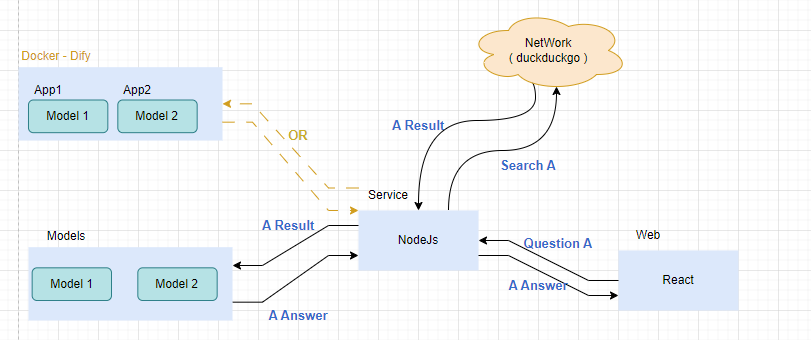
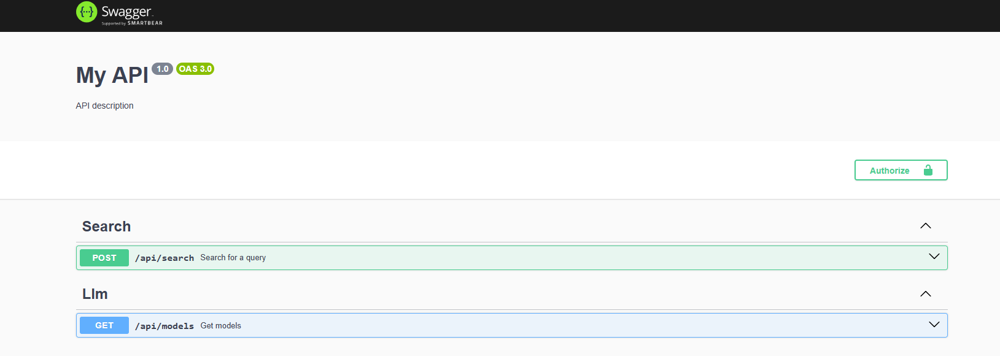
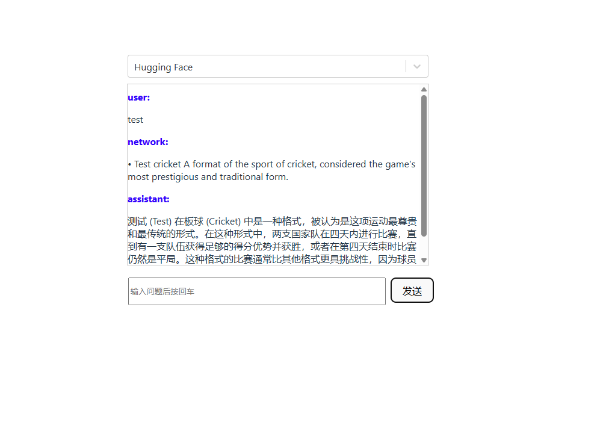

<div align="center">

# AI-Assistant
 

Support to change model and search in network (https://api.duckduckgo.com/)
</div>

## Environment
- [Dify in docker](https://docs.dify.ai/en/getting-started/install-self-hosted/docker-compose)
- nodeJs + NestJs
- React + typescript + vite

## Version
- Node V22.16.0

## Design


## Demo
### Service

### View



## Set up
```bash
# LLM
Deploy Dify in docker
  - git clone https://github.com/langgenius/dify.git --branch 1.4.1
  - cd dify/docker
  - cp .env.example .env
  - docker compose up -d
  - http://localhost/install
Create app for with related model

# View
cd rudy-assist
yarn install
yarn dev

# Service
cd search-service
yarn install
yarn start
```

## Optimization Points
- [ ] Performance
- [ ] Page Style
- [ ] Authentication
- [ ] Log
- [ ] Remove Dify
- [ ] Database