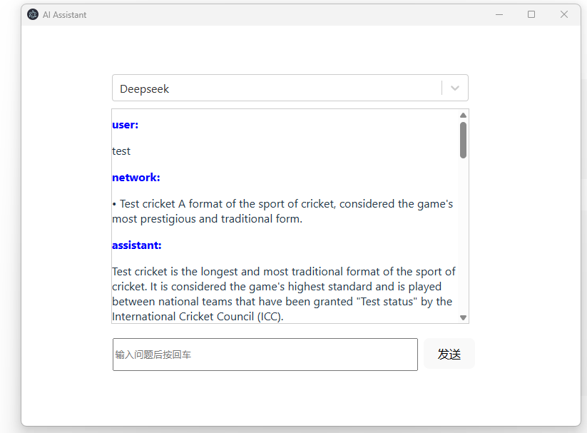

<div align="center">

# AI-Assistant
 

Support to change model and search in network (https://api.duckduckgo.com/)
</div>

## Environment
- [Dify in docker](https://docs.dify.ai/en/getting-started/install-self-hosted/docker-compose)
- nodeJs + NestJs
- React + typescript + vite

## Version
- Node V22.16.0

## Design


## Demo
### Service

### View



## Set up
```bash
# View
cd rudy-assist
yarn install
yarn dev

# Service
Apply Model Key
  - deepseek
  - hugging face

cd search-service
cp .env.example .env
Update env key

yarn install
yarn start
```

## Optimization Points
- [ ] Performance
- [ ] Page Style
- [ ] Authentication
- [ ] Log
- [x] Remove Dify
- [ ] Database